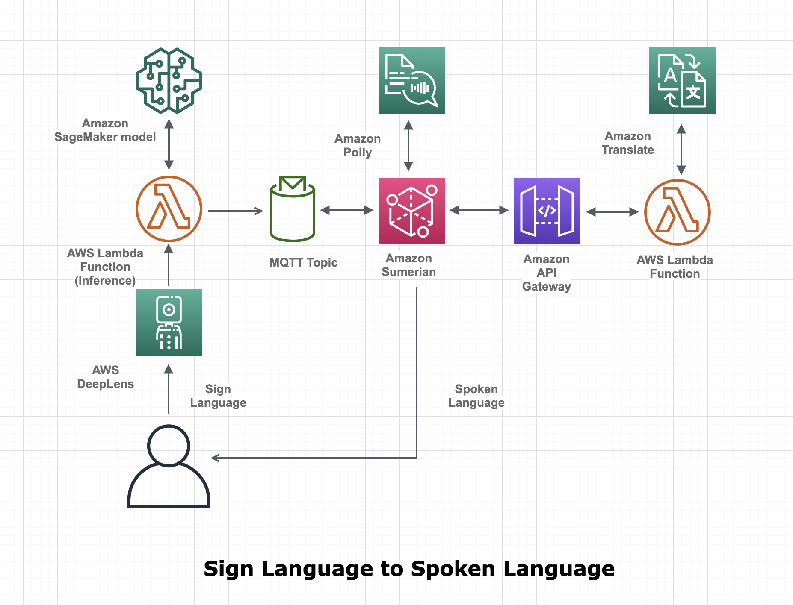

# AI and VR powered communication system between spoken language and sign language

## Project Overview
This repository provides the resources and instructions required to create your own version of the communication system between spoken and sign language, which was on display at the Builder's Fair during re:Invent 2019. 

## Project Description
The “AI and VR powered communication system for spoken language and Sign Language” enable people who doesn't know Sign Language to communicate with the person who communicate only through Sign Language. The solution uses Artificial Intelligence and Virtual Reality to perform rapid translation and allows multi-mode communication.

## Attendee Experience:
Attendees will be viewing a web application and based on the content they speak the solution will automatically transcribe the voice and translate it to American Sign Language (ASL) and perform it through finger spelling as animated person on the VR application hosted in website. Similarly, they can perform ASL in front of AWS DeepLens which will be able to recognize the content and translate it to one of the spoken language and voice over it through Amazon Polly. This solution explains how to easily build a complex communication system using the combination of Amazon SageMaker, Amazon Transcribe, Amazon Translate and Amazon Sumerian.

## Architecture

### Sign to Speak Flow

* Machine Learning model to convert the Sign Language finger spelling to English alphabet has been trained using Amazon SageMaker and deployed in AWS DeepLens
* When users perform American Sign Language (ASL) finger spelling in front of the DeepLens it will convert that in to English characters and send that via MQTT to AWS IoT
* AWS IoT Collects those MQTT messages and send them to Amazon Polly to convert the text to speech and play that back in the web interface
* There is an option to translate the language from English to other languages using Amazon Translate and then convert to speech.

### Speak to Sign Flow

* In the web interface there is a microphone button which will start streaming the live audio signals to Amazon Transcribe Streaming using websockets
* Transcribe will convert the speech to text and send English characters to Amazon Sumerian which is a Virtual Reality Engine.
* Amazon Sumerian has a logic which will convert the English alphabet to specific ASL sign on an animated character